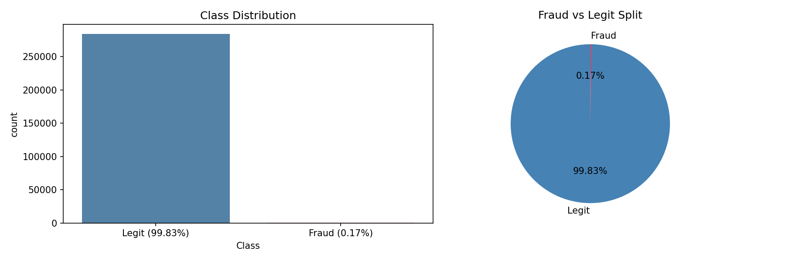
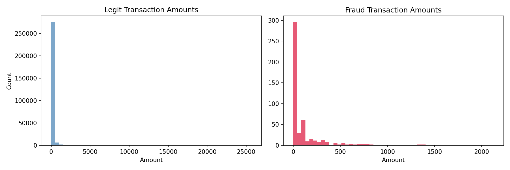
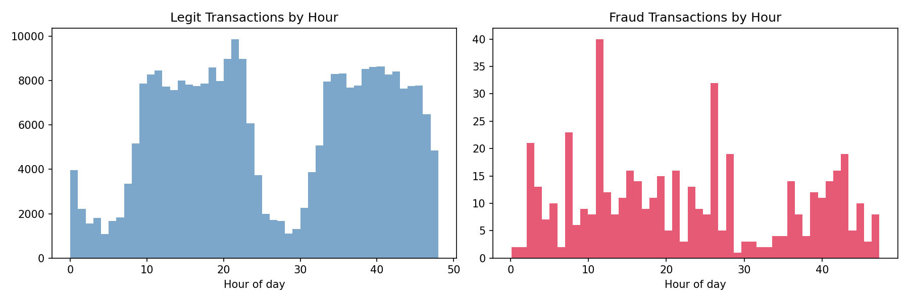
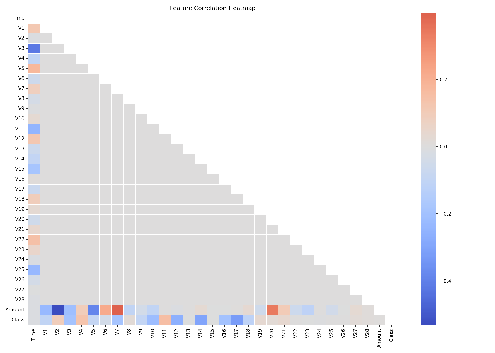
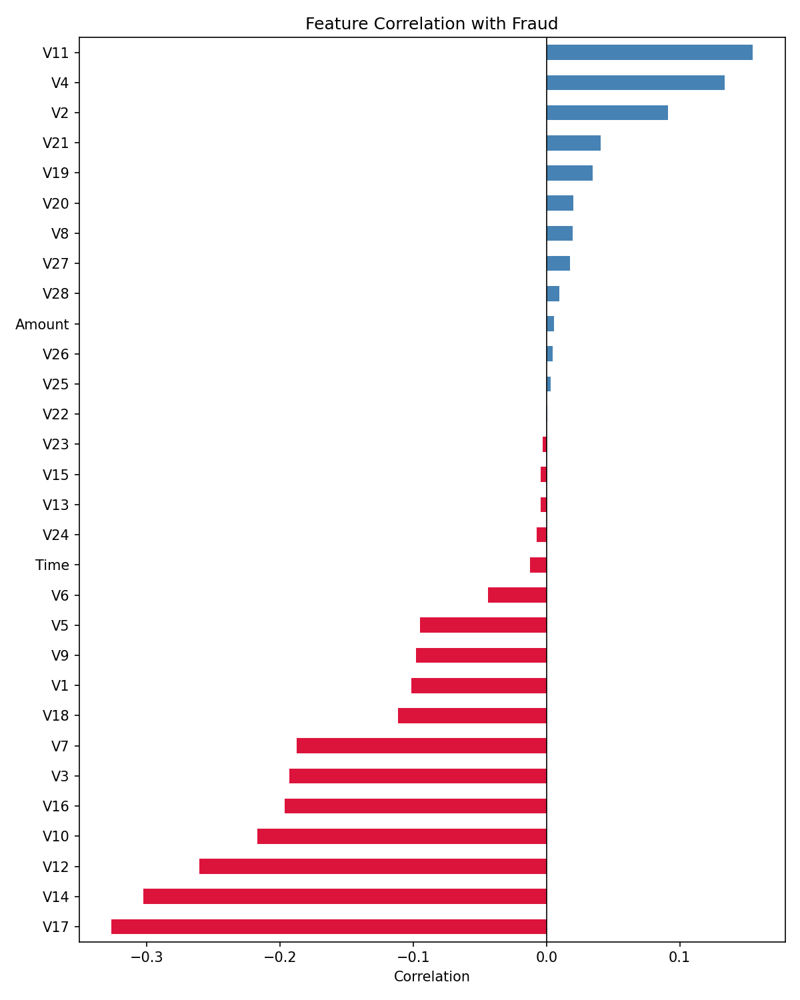
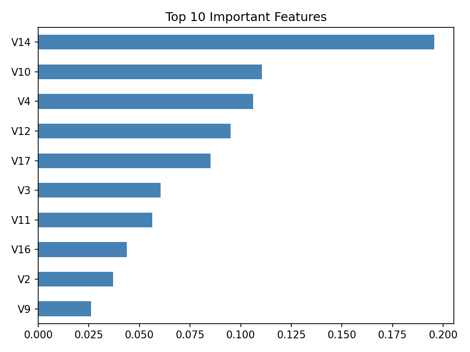
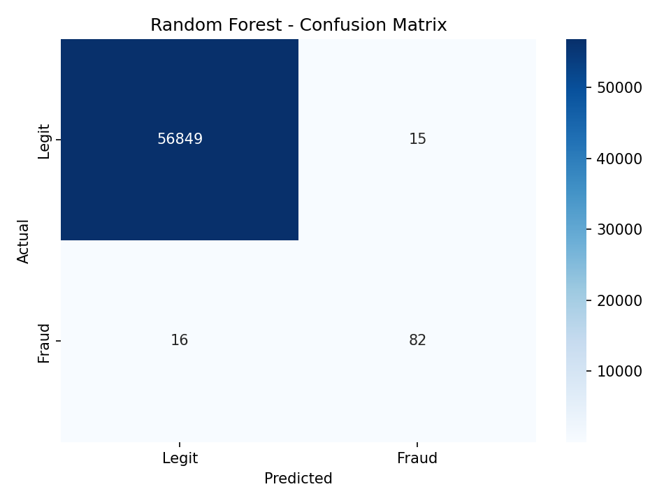

# 🔍 Credit Card Fraud Detection — End-to-End ML System

> Detects fraudulent credit card transactions in real-time using Machine Learning, trained on **284,807 real transactions** with a Gradio-powered interactive UI.


---

## 🎯 What This Project Does

Financial fraud costs businesses **billions every year.** This project builds a production-ready fraud detection system that:

- Analyzes transaction patterns to flag suspicious activity
- Handles **severely imbalanced data** (only 0.17% fraud cases) using SMOTE
- Achieves **97% ROC-AUC** with high fraud precision to minimize false alarms
- Provides an **interactive UI** where you can test any transaction instantly

---

## 🚀 Live Demo

```bash
git clone https://github.com/svara1410/creditcard-fraud-detection
cd creditcard-fraud-detection
pip install -r requirements.txt
python model.py       # Train & save the model (~2 mins)
python app.py         # Launch UI at http://localhost:7860
```

---

## 📊 Results

| Model | ROC-AUC | Fraud Recall | Fraud Precision |
|---|---|---|---|
| Logistic Regression | 0.97 | 0.92 | 0.06 |
| **Random Forest ✅** | **0.97** | **0.84** | **0.85** |

**Why Random Forest?** — Much higher precision (0.85 vs 0.06) means far fewer false alarms. In real banking systems, flagging legitimate transactions as fraud destroys customer trust — precision matters as much as recall.

---

## 🧠 Technical Approach

### The Core Challenge — Class Imbalance
Only 492 out of 284,807 transactions are fraudulent (0.17%). A naive model that predicts "not fraud" every time gets 99.83% accuracy but catches zero fraud. This is why accuracy alone is a useless metric here.

**Solution:** SMOTE (Synthetic Minority Oversampling Technique) — generates synthetic fraud samples during training so the model actually learns what fraud looks like.

### Pipeline
```
Raw Data (284K transactions)
        ↓
Exploratory Data Analysis
  • Class distribution
  • Amount & time patterns
  • Correlation heatmaps
        ↓
Preprocessing
  • Feature scaling
  • SMOTE oversampling
        ↓
Model Training
  • Logistic Regression (baseline)
  • Random Forest (final model)
        ↓
Evaluation
  • ROC-AUC, Precision, Recall, F1
  • Confusion Matrix
        ↓
Gradio UI Deployment
  • Nearest-neighbor transaction matching
  • Real-time fraud prediction
```

### Why These Metrics?
Standard accuracy is **misleading** on imbalanced datasets. This project uses:
- **ROC-AUC** — measures model's ability to distinguish fraud vs legit across all thresholds
- **Precision** — of all flagged transactions, how many were actually fraud?
- **Recall** — of all actual fraud, how many did we catch?
- **F1-Score** — balance between precision and recall

---

## 📁 Project Structure

```
creditcard-fraud-detection/
├── model.py                  # Full ML pipeline (EDA → training → saving)
├── app.py                    # Gradio UI for real-time predictions
├── requirements.txt
├── README.md
└── visualizations/
    ├── class_distribution.png
    ├── confusion_matrix.png
    ├── correlation_heatmap.png
    ├── feature_importance.png
    ├── amount_distribution.png
    ├── fraud_correlation.png
    └── time_analysis.png
```

---

## 🛠️ Tech Stack

| Category | Tools |
|---|---|
| Language | Python 3.9+ |
| ML | Scikit-learn, Imbalanced-learn |
| Data | Pandas, NumPy |
| Visualization | Matplotlib, Seaborn |
| UI | Gradio |
| Dataset | Kaggle — ULB Credit Card Fraud |

---

## 📈 Key Visualizations

### Class Distribution (Before SMOTE)


### Transaction Amount — Fraud vs Legitimate


### When Fraud Happens — Time Analysis


### Feature Correlation Heatmap


### Fraud-Specific Correlations


### Random Forest — Feature Importance


### Model Performance — Confusion Matrix


---

## 💡 Key Learnings & Design Decisions

- **SMOTE over undersampling** — preserves all legitimate transaction data while fixing imbalance
- **Random Forest over Logistic Regression** — despite same ROC-AUC, RF's 0.85 precision vs 0.06 makes it far more practical
- **Nearest-neighbor matching in UI** — real transaction data has PCA-transformed features; the UI maps user input to the closest real transaction for realistic predictions
- **ROC-AUC as primary metric** — not accuracy, because of extreme class imbalance

---

## 📌 Dataset

[Kaggle — Credit Card Fraud Detection](https://www.kaggle.com/datasets/mlg-ulb/creditcardfraud)

- 284,807 transactions over 2 days
- 492 fraud cases (0.17%)
- Features V1–V28 are PCA-transformed for confidentiality
- Features: Time, Amount, Class (0 = legit, 1 = fraud)

---

## 👩‍💻 About

Built by **Svara Chheda** — AI/ML Developer specializing in Python, data science, and end-to-end ML systems.

🔗 [GitHub](https://github.com/svara1410) • [LinkedIn](https://www.linkedin.com/in/svara-chheda-75301b28b)

---

*Open to freelance ML/AI projects — feel free to reach out!*
